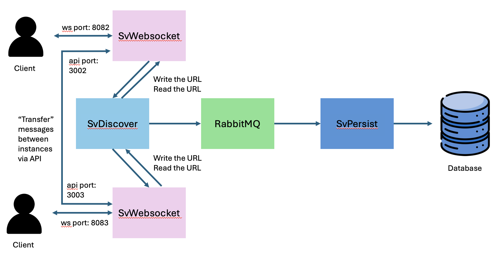

## SimpleChat





### About: Microservices Architecture
- A chat app that uses microservices architecture to enable **scalability**.
- Multiple SvWebsocket instances can be set up to accomodate for any number of websocket connections reuqired.
- To enable the messages to be routed correctly, there is a need to store which SvWebsocket instance the ws connection is connected. Various apis on SvDiscover are exposed for the purpose of writing and reading the URL for the SvWebsocket instance.
- RabbitMQ is used to connect the multiple SvWebsocket instances with SvPersist. SvWebsocket pushes messages to the queue, whereas SvPersist consumes from the queue and writes to the DB. Producers and consumers of RabbitMQ can be configured to increase throughput
- The hosts and ports can be configured; See the respective `package.json` for the flags accepted

#### SvWebsocket
- Each instance can allow for multiple websocket connections from different clients
- If the sender and recipient are connected to the same SvWebsocket instance, then it will immediately route the message to the recipient
- If the sender and recipient are NOT connected to the same SvWebsocket instance, then it will need to find the URL of the recipient's SvWebsocket by getting it from SvDiscover via API calls. Then make an API call to the recipient's SvWebsocket instance to send it to the recipient
- A **connection pool** of RabbitMQ producers were created to reduce the cost of creating and closing multiple connections

#### SvDiscover
- A service that stores the mapping of the userId with the SvWebsocket URL that the user's websocket connection is with
- Aim is for different SvWebsocket instances to communicate via API calls to send messages that involve users on 2 different SvWebsocket instances
- Records will be created when ws connections are created, and deleted when the ws connection closes

#### SvPersist
- A service that consumes messages from the RabbitMQ queue and then write it to the Postgresql DB for pesistence
- A **connection pool** of RabbitMQ consumers were created to reduce the cost of creating and closing multiple connections


### Technology
- Websocket: Real-time bi-directional networking
- Redis: Cache the mapping of userId and URL
- RabbitMQ: Decouple message routing and db writes
- PostgreSQL: Database used to save the messages
- TypeScript: Provide typing support
- Sequelize: ORM used to connect and interact with the PostgreSQL database
- Sequelize CLI: To run the migrate files
- ts-node: Run TS scripts by compiing on the fly

### Necessary Files
- .env file in root directory; variables to include
  - `ENVIRONMENT`

### Quick Start:
- `SvDiscover`:
```bash
cd SvDiscover

docker pull redis

# Start redis docker container
docker run --name redis -p 6379:6379 -d redis

# Start the SvDiscover
npm run start-discover
```

- `SvPersist`:
```bash
cd SvPersist

# Pull postgres docker image
docker pull postgres

# Start the posgres docker container
docker run --name some-postgres -e POSTGRES_PASSWORD=password -p 5432:5431 -d postgres

# Pull rabbitmq image
docker pull rabbitmq:3-management

# Start the rabbitmq container
docker run -d --name rabbitmq -p 5672:5672 -p 15672:15672 rabbitmq:3-management

# This generates the config json file which is required when you migrate the schemas to the database
npm run script ./scripts/genConfig

# Compile typescript code into javascript
npm run build

# Create the database
npm run db:create

# Migrate schema
npm run db:migrate

# Start the server
npm run start-persist
```

- `SvWebsocket`:
```bash
cd SvWebsocket

# Start the SvWebsocket
npm run start-ws

# Another SvWebsocket
npm run start-ws-2
```


### Test
- Open 2 pages to ```localhost:3002/client```
- Key in the user id and recipient id on both pages, but in reverse order to talk to each other
- Click `register`
- Type in the text box and click send
- Start chatting away!

### Tutorials:
- Websocket:
  - https://www.blackslate.io/articles/real-time-communication-with-nodejs-express-websockets
  - https://dev.to/hamzakhan/built-in-websockets-in-nodejs-2024-a-comprehensive-guide-2236
- RabbitMQ:
  - Intro: https://www.cloudamqp.com/blog/part1-rabbitmq-for-beginners-what-is-rabbitmq.html
  - Exchange Types: https://www.cloudamqp.com/blog/part4-rabbitmq-for-beginners-exchanges-routing-keys-bindings.html
  - Management Plugin: https://geshan.com.np/blog/2024/05/rabbitmq-docker/
  - https://medium.com/cwan-engineering/rabbitmq-concepts-and-best-practices-aa3c699d6f08
- Redis:
  - https://www.digitalocean.com/community/tutorials/how-to-implement-caching-in-node-js-using-redis
  - https://github.com/redis/node-redis

### TODO:
- Look into bulk inserts for the db to speed up the db inserts
- Add history api to get all the past messages